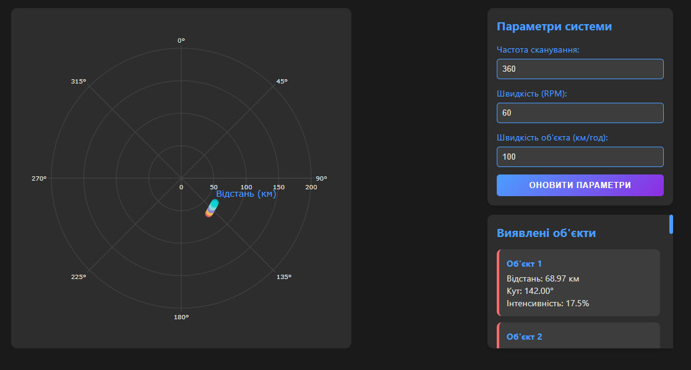
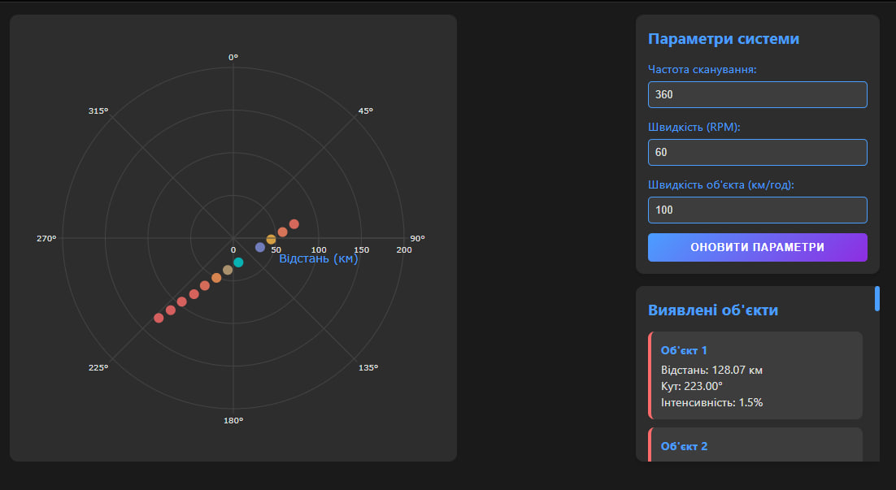

# Лабораторна робота №4
## Розробка додатку для візуалізації вимірювань радару

Codepen: https://codepen.io/Min-Max_Reid/pen/dyxroyW

### Мета роботи
Ознайомитись з принципами роботи радару та розробити веб-додаток для візуалізації даних, отриманих з емульованої вимірювальної частини радару.

### Теоретичні відомості

**1. Принцип роботи радару (RADAR - Radio Detection and Ranging)**

Радар - це пристрій, який використовує радіохвилі для виявлення об'єктів та визначення їх місцезнаходження. Основні етапи роботи:
- Випромінювання радіохвиль через антену
- Відбиття хвиль від об'єктів
- Прийом відбитих хвиль
- Обробка та аналіз отриманих даних
- Візуалізація результатів

**2. Основні параметри радару**
- Відстань до об'єкта (розраховується за часом затримки сигналу)
- Напрямок (азимут та висота)
- Швидкість об'єкта (визначається за ефектом Доплера)

**3. Формули для розрахунків**

Відстань до цілі розраховується за формулою:
```
R = (c * t) / 2
```
де:
- R - відстань до цілі (км)
- c - швидкість світла (≈300 000 км/с)
- t - час поширення сигналу (с)

### Хід роботи

**1. Налаштування середовища розробки:**
- Встановлення Docker
- Завантаження образу радар-емулятора
- Налаштування WebSocket з'єднання

**2. Розробка веб-додатку:**
- Створення HTML структури для відображення даних
- Написання JavaScript коду для обробки WebSocket повідомлень
- Реалізація візуалізації даних у полярних координатах

**3. Реалізація функціоналу:**
- Підключення до WebSocket серверу
- Обробка отриманих даних
- Відображення цілей на графіку
- Реалізація зміни параметрів через API

### Основний програмний код

``` html 
<!DOCTYPE html>
<html lang="uk">
<head>
    <meta charset="UTF-8">
    <title>Моніторинг</title>
    <script src="https://cdnjs.cloudflare.com/ajax/libs/plotly.js/2.27.1/plotly.min.js"></script>
</head>
<body>
    <div class="wrapper">
        <main class="dashboard">
            <div class="left-panel">
                <div id="radarPlot"></div>
            </div>
            
            <div class="right-panel">
                <div class="control-panel">
                    <h2>Параметри системи</h2>
                    <div class="control-group">
                        <label>
                            Частота сканування:
                            <input type="number" id="measurementsPerRotation" value="360">
                        </label>
                    </div>
                    <div class="control-group">
                        <label>
                            Швидкість (RPM):
                            <input type="number" id="rotationSpeed" value="60">
                        </label>
                    </div>
                    <div class="control-group">
                        <label>
                            Швидкість об'єкта (км/год):
                            <input type="number" id="targetSpeed" value="100">
                        </label>
                    </div>
                    <button class="update-btn" onclick="updateConfig()">Оновити параметри</button>
                </div>

                <div id="targetInfo" class="target-panel">
                    <h2>Виявлені об'єкти</h2>
                </div>
            </div>
        </main>
    </div>
</body>
</html>
```

``` css
* {
    margin: 0;
    padding: 0;
    box-sizing: border-box;
}

body {
    font-family: 'Segoe UI', Tahoma, Geneva, Verdana, sans-serif;
    background: #1a1a1a;
    color: #e0e0e0;
    min-height: 100vh;
}

.wrapper {
    max-width: 1100px;
    margin: 0 auto;
    padding: 15px;
}

h2 {
    color: #4a9eff;
    margin-bottom: 15px;
    font-size: 1.2em;
}

.dashboard {
    display: grid;
    grid-template-columns: 1fr 300px;
    gap: 15px;
}

.left-panel {
    background: #2d2d2d;
    border-radius: 10px;
    padding: 25px; 
    aspect-ratio: 1;
    height: 550px; 
}

.right-panel {
    display: flex;
    flex-direction: column;
    gap: 15px;
    height: 550px; 
}

.control-panel {
    background: #2d2d2d;
    padding: 15px;
    border-radius: 10px;
    box-shadow: 0 4px 6px rgba(0, 0, 0, 0.1);
}

.control-group {
    margin-bottom: 12px;
}

label {
    display: flex;
    flex-direction: column;
    gap: 6px;
    color: #4a9eff;
    font-size: 0.9em;
}

input {
    padding: 8px;
    background: #3d3d3d;
    border: 1px solid #4a9eff;
    border-radius: 5px;
    color: #e0e0e0;
    font-size: 13px;
    transition: all 0.3s ease;
}

input:focus {
    border-color: #8e2de2;
    box-shadow: 0 0 5px rgba(142, 45, 226, 0.5);
    outline: none;
}

.update-btn {
    width: 100%;
    background: linear-gradient(135deg, #4a9eff, #8e2de2);
    color: white;
    border: none;
    padding: 10px 20px;
    border-radius: 5px;
    cursor: pointer;
    transition: all 0.3s ease;
    font-weight: bold;
    text-transform: uppercase;
    letter-spacing: 1px;
    font-size: 0.8em;
}

.update-btn:hover {
    transform: translateY(-2px);
    box-shadow: 0 4px 15px rgba(74, 158, 255, 0.3);
}

#radarPlot {
    width: 100%;
    height: 100% !important;
}

.target-panel {
    background: #2d2d2d;
    padding: 15px;
    border-radius: 10px;
    flex-grow: 1;
    overflow-y: auto;
    box-shadow: 0 4px 6px rgba(0, 0, 0, 0.1);
}

.target-item {
    background: #3d3d3d;
    margin-bottom: 10px;
    padding: 12px;
    border-radius: 8px;
    border-left: 4px solid;
    transition: transform 0.2s ease;
    font-size: 0.9em;
}

.target-item:hover {
    transform: translateX(5px);
}

.target-item strong {
    color: #4a9eff;
    display: block;
    margin-bottom: 4px;
}

.target-panel::-webkit-scrollbar {
    width: 6px;
}

.target-panel::-webkit-scrollbar-track {
    background: #2d2d2d;
}

.target-panel::-webkit-scrollbar-thumb {
    background: #4a9eff;
    border-radius: 4px;
}
```

``` javascript
let socket;
let plotData = {
    r: [],
    theta: [],
    mode: 'markers',
    marker: {
        color: [],
        size: 12,
        opacity: 0.8,
        colorscale: [
            [0, '#ff6b6b'],
            [0.25, '#ffd93d'],
            [0.5, '#6c5ce7'],
            [0.75, '#a8e6cf'],
            [1, '#00d2d3']
        ]
    },
    type: 'scatterpolar'
};

const layout = {
    polar: {
        radialaxis: {
            title: 'Відстань (км)',
            range: [0, 200],
            tickfont: { color: '#e0e0e0', size: 10 },
            gridcolor: '#444444',
            titlefont: { color: '#4a9eff' }
        },
        angularaxis: {
            direction: 'clockwise',
            period: 360,
            tickfont: { color: '#e0e0e0', size: 10 },
            gridcolor: '#444444'
        },
        bgcolor: '#2d2d2d'
    },
    showlegend: false,
    paper_bgcolor: '#2d2d2d',
    plot_bgcolor: '#2d2d2d',
    font: { color: '#e0e0e0' },
    margin: { t: 40, b: 40, l: 40, r: 40 }, 
    autosize: true
};

Plotly.newPlot('radarPlot', [plotData], layout, {
    responsive: true, 
    displayModeBar: false
});


function connectWebSocket() {
    socket = new WebSocket('ws://localhost:4000');
    
    socket.onmessage = (event) => {
        const data = JSON.parse(event.data);
        processRadarData(data);
    };

    socket.onclose = () => {
        setTimeout(connectWebSocket, 5000);
    };
}

function processRadarData(data) {
    const speedOfLight = 299792.458;
    const currentTime = new Date().getTime();
    
    data.echoResponses.forEach(echo => {
        const distance = (echo.time * speedOfLight) / 2;
        plotData.r.push(distance);
        plotData.theta.push(data.scanAngle);
        plotData.marker.color.push(echo.power);
    });

    if (plotData.r.length > 12) {
        plotData.r.splice(0, plotData.r.length - 12);
        plotData.theta.splice(0, plotData.theta.length - 12);
        plotData.marker.color.splice(0, plotData.marker.color.length - 12);
    }

    Plotly.update('radarPlot', 
        {
            r: [plotData.r],
            theta: [plotData.theta],
            'marker.color': [plotData.marker.color]
        }
    );

    updateTargetInfo(plotData.r, plotData.theta, plotData.marker.color, currentTime);
}

function getColor(intensity) {
    const colors = [
        { value: 0.2, color: '#ff6b6b' },
        { value: 0.4, color: '#ffd93d' },
        { value: 0.6, color: '#6c5ce7' },
        { value: 0.8, color: '#a8e6cf' },
        { value: 1.0, color: '#00d2d3' }
    ];
    
    for (let i = 0; i < colors.length; i++) {
        if (intensity <= colors[i].value) {
            return colors[i].color;
        }
    }
    return colors[colors.length - 1].color;
}

function updateTargetInfo(r, theta, intensities, time) {
    let targetInfo = '<h2>Виявлені об\'єкти</h2>';
    const currentTime = new Date().getTime();

    for (let i = 0; i < r.length; i++) {
        const distance = r[i].toFixed(2);
        const angle = theta[i].toFixed(2);
        const intensity = intensities[i];
        const targetAge = currentTime - time;

        if (targetAge <= 5000) {
            targetInfo += `
                <div class="target-item" style="border-left-color: ${getColor(intensity)}">
                    <strong>Об'єкт ${i + 1}</strong>
                    <div>Відстань: ${distance} км</div>
                    <div>Кут: ${angle}°</div>
                    <div>Інтенсивність: ${(intensity * 100).toFixed(1)}%</div>
                </div>
            `;
        }
    }

    document.getElementById('targetInfo').innerHTML = targetInfo;
}

async function updateConfig() {
    const button = document.querySelector('.update-btn');
    button.disabled = true;
    button.textContent = 'Оновлення...';

    const config = {
        measurementsPerRotation: parseInt(document.getElementById('measurementsPerRotation').value),
        rotationSpeed: parseInt(document.getElementById('rotationSpeed').value),
        targetSpeed: parseInt(document.getElementById('targetSpeed').value)
    };

    try {
        const response = await fetch('http://localhost:4000/config', {
            method: 'PUT',
            headers: {
                'Content-Type': 'application/json'
            },
            body: JSON.stringify(config)
        });

        if (!response.ok) {
            throw new Error(`HTTP error! status: ${response.status}`);
        }

        button.textContent = 'Успішно';
        setTimeout(() => {
            button.disabled = false;
            button.textContent = 'Оновити параметри';
        }, 2000);
    } catch (error) {
        button.textContent = 'Помилка';
        setTimeout(() => {
            button.disabled = false;
            button.textContent = 'Оновити параметри';
        }, 2000);
    }
}

connectWebSocket();
```

# Глобальні змінні:
- socket - для WebSocket з'єднання
- plotData - для зберігання даних графіку
- layout - налаштування відображення графіку

# Методи:
1. **connectWebSocket()**
   - Створює WebSocket з'єднання
   - Обробляє вхідні повідомлення
   - Автоматично перепідключається

2. **processRadarData(data)**
   - Обробляє дані від радару
   - Обчислює відстань
   - Оновлює графік

3. **getColor(intensity)**
   - Повертає колір залежно від інтенсивності сигналу

4. **updateTargetInfo(r, theta, intensities, time)**
   - Оновлює інформацію про цілі на панелі

5. **updateConfig()**
   - Оновлює конфігурацію радару
   - Відправляє дані на сервер

# Константи:
- speedOfLight = 299792.458 (швидкість світла, км/с)
- Масив кольорів для різних інтенсивностей сигналу

### Результати роботи програми

**Початкова конфігурація системи:**

<p align="center"></p>

На зображенні показано роботу системи з початковими параметрами:
- Частота сканування: 360
- Швидкість обертання: 60 RPM
- Швидкість об'єкта: 100 км/год

Об'єкт відображається на відстані близько 69 км під кутом 142°, з інтенсивністю сигналу 17.5%.

**Змінена конфігурація системи:**

<p align="center"></p>

Після збільшення швидкості об'єкта до 1000 км/год спостерігаємо:
- Об'єкт залишає "слід" на радарі через більшу швидкість переміщення
- Змінилась позиція об'єкта: відстань збільшилась до 128 км, кут змінився до 223°
- Інтенсивність сигналу зменшилась до 1.5% через збільшення відстані
- На графіку чітко видно траєкторію руху об'єкта, позначену точками різних кольорів, що відображають зміну інтенсивності сигналу


### Висновки
В ході виконання лабораторної роботи було:
1. Вивчено принципи роботи радару
2. Розроблено веб-додаток для візуалізації даних
3. Реалізовано підключення до емулятора через WebSocket
4. Створено інтерфейс для відображення та керування параметрами радару

Робота з реальними даними радару допомогла краще зрозуміти принципи обробки та візуалізації даних у реальному часі.
